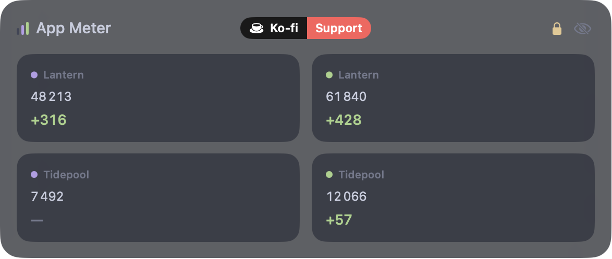

# App Meter

[](https://github.com/TadelUnso/app-meter/actions/workflows/ci.yml)
[](LICENSE)
[](https://ko-fi.com/tadel_unso)

**App Meter** is a macOS desktop widget for app developers: the lifetime install
count of every app you publish, and how much it grew today — App Store and
Google Play side by side, right on your desktop. Native Swift + SwiftUI, a
borderless window living at desktop level, above the wallpaper and below
application windows.



Figures come from your own developer accounts. Neither store publishes exact
install counts publicly, so App Meter cannot work from a store link: it reads
the reports Apple and Google produce for you, using credentials you supply.

## Features

- **Lifetime installs per app** — both figures are reconstructed by summing
  daily install counts across report history: Apple's counts first-time
  downloads (updates and redownloads excluded) and is cached locally; Google's
  is summed from every monthly Play statistics export, since the export's own
  running total has read zero since a July 2026 format change
- **Today's growth** — the most recent day each store has reported, shown as a
  green delta next to the total
- **Adaptive layout** — one app fills the panel, two to four share a grid, five
  or more collapse into rows. A written label tells the stores apart: "APP
  STORE" or "GOOGLE PLAY", each in its own colour
- Either store works on its own — configure only the one you publish to
- Errors ride under the figures, never in place of them: one store failing does
  not blank the other's numbers
- Visible on all Spaces, ignored by Mission Control and ⌘Tab, stays below
  regular windows
- Drag it anywhere; position is remembered across launches
- Resizable: drag either side edge (320–900 pt), saved across launches
- 🔒 Clickable lock icon (plus a "Lock position" menu item) pins both position
  and size
- On screen for as long as the app runs; quit from the menu bar to close it
- Launch at login toggle; no Dock icon

## Requirements

- macOS 14+
- Swift 6 toolchain — Command Line Tools are enough (`xcode-select --install`),
  full Xcode is not required
- An App Store Connect account with the Admin, Account Holder or Finance role,
  for the Apple half
- A Google Play developer account, for the Android half

## Install

### From source

```bash
make app
open "dist/App Meter.app"   # or move it to /Applications
```

## Setup

Open **Settings…** from the menu bar icon (or press ⌘,) and fill in the fields
below. The two key files are copied into your login Keychain; everything else is
a normal preference.

### App Store Connect

You need four things: an issuer ID, a key ID, a vendor number and a `.p8`
private key.

1. Go to [Users and Access → Integrations → App Store Connect API](https://appstoreconnect.apple.com/access/integrations/api).
2. **Issuer ID** is the UUID near the top of the page, with a *Copy* link beside
   it. It is shared by every key on the team.
3. Press **+** next to the *Active* table to generate a key. Name it anything;
   give it **Sales and Reports** access, or **Finance** if that is the closest
   your account offers. Reports on installs are all App Meter reads — no key
   with write access is needed.
4. The new row shows its **Key ID** — ten characters, the same ones that appear
   in the downloaded filename, `AuthKey_<keyID>.p8`.
5. Download the key from that row. **App Store Connect serves the `.p8` once.**
   If it is lost the key can only be revoked and replaced.
6. The **vendor number** lives elsewhere: **Business → Payments and Financial
   Reports**, top left, beside the team name. Digits only.

If you already have a key with Sales and Reports or Finance access *and* still
have its `.p8`, reuse it — there is no reason to generate a second one.

### Google Play

You need two things: a service account key, and the bucket your reports are
exported to.

1. In the [Google Cloud console](https://console.cloud.google.com), under
   **IAM & Admin → Service Accounts**, create a service account. Grant it no
   roles in Cloud — its access comes from Play, in step 3.
2. Open the account, go to **Keys → Add key → Create new key**, and choose
   **JSON**. That downloaded file is what App Meter asks for.
3. In the [Play Console](https://play.google.com/console), go to **Users and
   permissions → Invite new user**, enter the service account's address
   (`…@….iam.gserviceaccount.com`) and grant **View app information and download
   bulk reports (read-only)**. Without this the key exists but reaches nothing.
   Access can take up to 24 hours to propagate after the invite.
4. For the bucket, go to **Download reports → Statistics** and press **Copy
   Cloud Storage URI** beside the *Installs* heading. What lands on the
   clipboard is the bucket with a path attached —
   `gs://pubsite_prod_<account id>/stats/installs/`, or `pubsite_prod_rev_…` on
   older accounts. Paste it exactly as copied; the prefix and the path are
   stripped for you.
5. Also enable the **Cloud Storage API** for your project, under
   **APIs & Services → Library** — without it every read is refused regardless
   of permissions.

### Where the credentials end up

The `.p8` and the service account JSON go into the login Keychain, under the
service `com.sbezbabnykh.app-meter`. Once they are in, the copies you downloaded
can be filed away with the rest of your secrets and removed from disk.

The non-secret half — issuer id, key id, vendor number, bucket, refresh
interval — is stored as ordinary preferences in
`~/Library/Preferences/com.sbezbabnykh.app-meter.plist`. Apple's report history
cache lives in `~/Library/Application Support/App Meter/`.

## Freshness

Both stores publish reports on their own schedule, and App Meter is never
fresher than they are: Apple's daily reports land about a day behind, Google's
about three to seven days. Polling faster than hourly only spends request quota
re-reading yesterday's figures.

## Update

The widget keeps itself up to date via
[Sparkle](https://sparkle-project.org): it checks in the background and, when a
new signed release is available, offers to install it in place. You can also
check on demand from the menu bar icon → **Check for Updates…**.

## Uninstall

1. Toggle off **Launch at login** in the menu bar (if you enabled it) and quit
   the widget
2. Remove **App Meter.app** from wherever you put it
3. Optional cleanup — settings, report cache and Keychain items:

```bash
defaults delete com.sbezbabnykh.app-meter
rm -rf ~/Library/Application\ Support/App\ Meter
```

The two credentials stay in the login Keychain until you delete them in
Keychain Access (search for `com.sbezbabnykh.app-meter`), or remove them from
the widget's Settings before uninstalling.

## Feedback

Found a bug or have an idea? [Open an issue](https://github.com/TadelUnso/app-meter/issues) —
bug reports and feature requests are both welcome. The widget's menu bar icon
also has a **Report an Issue** shortcut.

## Development

```bash
make run    # run a dev build
make test   # run the test suite
```

> **Important:** run tests only via `make test`. On a machine without full Xcode
> a bare `swift test` silently runs zero tests and exits 0 — the Makefile passes
> the toolchain flags required for Swift Testing from Command Line Tools.

## Architecture

```
Sources/AppMeterCore/        — library
  Credentials/               — Keychain storage, credential shape checks
  Stores/                    — the data layer
    AppStoreConnectToken     —   ES256 JWT (CryptoKit, no dependencies)
    AppStoreConnectClient    —   sales reports API, gzip, TSV parsing
    SalesPeriod              —   yearly/monthly/daily plan for the lifetime sum
    InstallHistory           —   closed periods cached forever on disk
    GoogleServiceAccountToken —  RS256 JWT (Security.framework)
    GooglePlayClient         —   Cloud Storage reads, UTF-16 CSV parsing
  Views/                     — the panel: adaptive layout, settings window
  FiguresModel               — polling, per-store failure isolation
Sources/AppMeter/            — app shell: desktop window, menu bar, Sparkle
Tests/AppMeterCoreTests/     — the test suite
```

Zero third-party dependencies beyond [Sparkle](https://sparkle-project.org)
for updates: JWT signing, gzip, DER parsing and CSV are all done with what
ships in macOS.

## License

[MIT](LICENSE)
